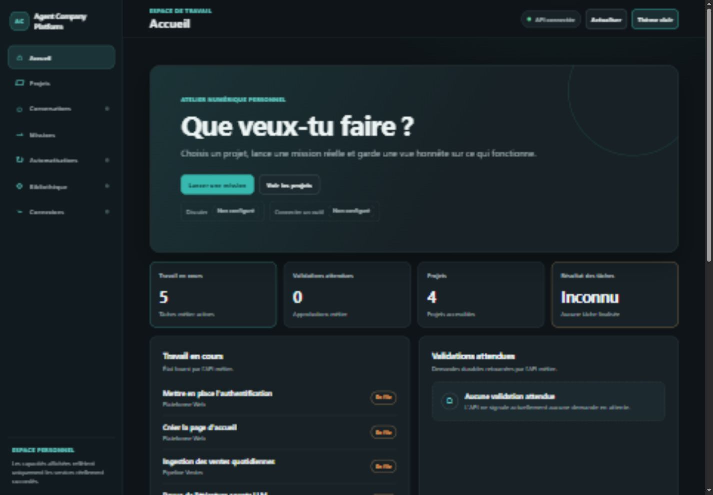

# Agent Company Platform

Poste de travail personnel pour organiser des projets et des missions, raccorder
Hermes Agent et, à terme, piloter des runners et outils spécialisés depuis le web et
un CLI commun.

La modernisation est engagée par tranches. Après les fondations du Lot A, le Lot B
ferme l'accès utilisateur, ajoute l'espace personnel et livre une conversation web
persistante adossée à l'API Runs officielle de Hermes. Les frontières de service et
les écritures web sensibles échouent désormais fermées. Une instance Hermes réelle,
un runner réel, le streaming et le CLI `acp` ne sont toutefois pas encore livrés. Le
détail exact se trouve dans
[l'état d'implémentation](docs/implementation-status.md).

Version préparée pour le Lot B : **0.3.0**. Les changements versionnés sont décrits dans
[CHANGELOG.md](CHANGELOG.md).



## Ce qui fonctionne aujourd'hui

- accueil, projets et composition d'une mission raccordés à l'API métier ;
- états chargement, vide, hors ligne, refus et non configuré sans données factices ;
- thèmes sombre/clair et disposition responsive ;
- bootstrap unique du propriétaire protégé par un secret dédié, mots de passe
  Argon2id et aucune inscription publique ;
- sessions opaques, hachées en base, expirables et révocables dans un cookie
  `HttpOnly` `SameSite=Strict`, avec jeton CSRF requis sur les mutations ;
- routes utilisateur fermées par défaut et lectures/écritures filtrées par les rôles
  propriétaire, opérateur/membre et lecteur au niveau du projet ;
- onboarding court avec diagnostic de préparation et création d'un projet dans un
  espace personnel masquant la hiérarchie historique ;
- conversations générales privées et conversations de projet persistées ; une clé
  d'idempotence durable conserve un seul Run logique même si l'admission est répétée,
  puis le tour est repris par consultation `GET` sans dépendre de l'onglet ouvert ;
- tâches, runs, workers enrôlés, leases, locks, approbations, événements persistés et
  métadonnées d'artefacts dans le socle FastAPI/SQLAlchemy ;
- provider Hermes `0.21.1` via `/health/detailed`, `/v1/capabilities` et
  `/v1/runs` ;
- diagnostic Hermes typé visible dans Connexions, sans clé dans le navigateur ;
- surface métier du provider-gateway privée derrière un Bearer inter-services ;
  ingestion du service d'événements protégée et WebSocket anonyme fermé par défaut ;
- simulation worker explicitement `blocked`, jamais présentée comme une exécution
  réussie ;
- refus d'un succès de run sans validation technique `passed` et preuve ;
- bureau pixel historique préservé mais non chargé par défaut.

Ce qui ne fonctionne pas encore est visible comme `Non configuré` et recensé dans
[le rapport d'acceptation](docs/acceptance-report.md). Le projet n'est pas prêt à
être exposé sur Internet.

## Architecture

```text
Web (Vite/TypeScript) ─┐
                      ├── API métier (FastAPI) ── base plateforme
CLI acp (à livrer) ───┘         │
                                ├── provider-gateway ── Hermes Agent séparé
                                ├── service d'événements
                                └── workers enrôlés ── runners à livrer
```

La plateforme est la source de vérité des projets, droits, missions et preuves.
Hermes reste la source de vérité de ses sessions, profils, modèles et skills. Les
identifiants doivent être rapprochés explicitement. Voir
[docs/architecture.md](docs/architecture.md) et
[docs/hermes-integration.md](docs/hermes-integration.md).

## Démarrage local de développement

Prérequis actuels : Python 3.11 ou supérieur, Node 22.12 ou supérieur, npm. Les
dépendances Python ne sont pas encore verrouillées et les scripts créent les tables
avec `create_all()` ; utiliser uniquement une machine de développement de confiance.

Sous Windows PowerShell :

```powershell
./scripts/setup.ps1
./scripts/dev.ps1
```

Sous Linux/macOS :

```bash
./scripts/setup.sh
./scripts/dev.sh
```

L'interface est ensuite disponible sur `http://localhost:5173`. Services locaux :

| Service | Port | Rôle |
|---|---:|---|
| web | 5173 | shell utilisateur |
| api | 8000 | projets, missions, droits et historique métier |
| event-service | 8001 | ingestion interne protégée ; temps réel utilisateur encore à livrer |
| provider-gateway | 8002 | frontière privée des providers, dont Hermes |

Copier les valeurs utiles de `.env.example` dans l'environnement du processus. Avant
le premier accès, générer au minimum un `ACP_BOOTSTRAP_TOKEN` long et aléatoire. Les
appels API/worker vers le gateway nécessitent aussi `ACP_GATEWAY_SERVICE_TOKEN` ;
l'ingestion d'événements utilise un `ACP_EVENT_SERVICE_TOKEN` distinct. Ne jamais
committer `.env`, une clé Hermes ou un jeton worker. Aucun secret par défaut n'est
fourni.

Au premier affichage, le formulaire « Sécuriser le premier accès » consomme le jeton
de bootstrap et crée l'unique propriétaire initial. Les visites suivantes restaurent
la session ou affichent la connexion ; elles ne rouvrent pas l'inscription. En HTTP
local uniquement, `ACP_SESSION_COOKIE_SECURE=0` est nécessaire ; utiliser `1` derrière
HTTPS.

Le seed local reste un jeu de démonstration et `create_all()` ne remplace pas des
migrations de production. Un worker doit être enregistré séparément selon
[la procédure Windows](docs/workers/windows-worker.md). Son mode simulation termine
en `blocked`. Aucun exécuteur réel n'est raccordé à la boucle worker actuelle.

## Hermes

Version attendue : Hermes Agent `0.21.1` (`v2026.9.7`). Sur Hermes, activer l'API
Server et générer une clé :

```text
API_SERVER_ENABLED=true
API_SERVER_KEY=<secret>
```

Sur le provider-gateway :

```text
HERMES_BASE_URL=<URL joignable depuis le gateway>
HERMES_API_KEY=<même secret>
ACP_GATEWAY_SERVICE_TOKEN=<secret inter-services partagé avec API et worker>
```

L'URL locale native est généralement `http://127.0.0.1:8642`, mais elle n'est pas
un défaut valable entre conteneurs ou services Railway. Le provider reste donc
indisponible tant que l'URL et la clé ne sont pas configurées. Aucun basculement
automatique vers un provider payant ou un plan local n'a lieu.

## Bureau pixel historique

Le moteur, les scènes et les données existantes sont conservés. Ils sont hors du
parcours principal et chargés uniquement avec :

```text
http://localhost:5173/?legacy-office=1
```

ou au build avec `VITE_ACP_LEGACY_OFFICE=1`. Les assets LimeZu restent des achats
séparés et ne doivent pas être redistribués. Voir
[la documentation d'installation](docs/assets/limezu-installation.md).

## Vérifications

Commandes principales :

```powershell
npm exec tsc -- --noEmit -p apps/web/tsconfig.json
npm test --workspace @acp/web
npm test --workspace @acp/pixel-office-engine
npm run build:web
python -m pytest -q
```

Les résultats réellement obtenus, l'environnement Python utilisé, les warnings et
les limites sont consignés dans [docs/acceptance-report.md](docs/acceptance-report.md).
Les tests Hermes, de conversation et de diagnostic utilisent un transport HTTP
simulé ; ils ne constituent pas une connexion à une instance Hermes réelle. La
reprise web actuelle repose sur un polling `GET`, pas sur un streaming SSE/WebSocket.

## Documentation

- [Audit de modernisation](docs/audit-modernisation.md)
- [Architecture et sources de vérité](docs/architecture.md)
- [Décisions de réutilisation](docs/reuse-decisions.md)
- [Système visuel](docs/design-system.md)
- [Intégration Hermes](docs/hermes-integration.md)
- [Sécurité](docs/security.md)
- [Centre MCP et skills — cible](docs/mcp-and-skills.md)
- [Studio en direct — cible](docs/live-studio.md)
- [Déploiement Railway](docs/deployment-railway.md)
- [Rapport d'acceptation](docs/acceptance-report.md)
- [État d'implémentation et reprise](docs/implementation-status.md)
