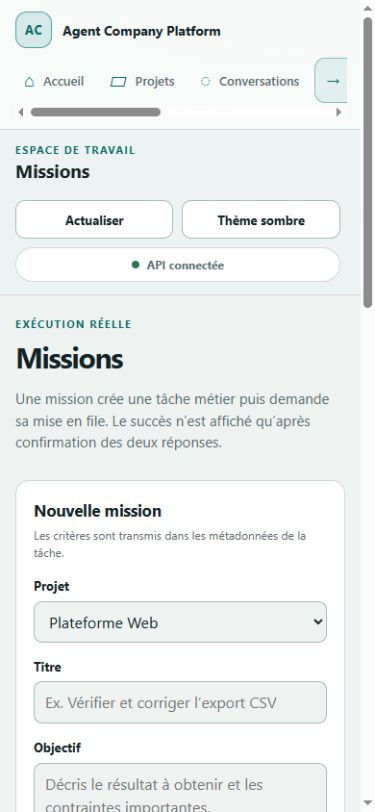

# Système visuel

Statut : base du Lot A implémentée dans `apps/web/src/workspace.css` et
`apps/web/src/workspace.ts`. Ce document décrit uniquement ce qui existe ou la
règle à respecter pour les écrans suivants.

## Intention

Agent Company Platform est un atelier numérique personnel : calme, dense sans être
chargé, et explicite sur les capacités disponibles. Le parcours principal n'utilise
ni pixel art, ni néon décoratif, ni glassmorphism. Le bureau historique est conservé
derrière `?legacy-office=1` ou `VITE_ACP_LEGACY_OFFICE=1` et n'est pas chargé par
défaut.

## Fondations

Les variables CSS `--workspace-*` constituent la source partagée actuelle.

| Rôle | Sombre | Clair | Usage |
|---|---:|---:|---|
| Fond | `#0e1417` | `#eef3f2` | canevas global |
| Surface | `#172126` | `#ffffff` | sections et formulaires |
| Surface élevée | `#1c292f` | `#f4f8f7` | contrôles et éléments actifs |
| Texte | `#edf4f4` | `#152326` | contenu principal |
| Texte secondaire | `#a8b7bb` | `#596b6f` | aide et métadonnées |
| Accent | `#38b9b0` | `#087f79` | action et navigation active |
| Accent chaud | `#e6a15a` | `#a95e17` | attention non bloquante |
| Danger | `#f17b73` | `#b23b35` | erreur ou blocage |
| Succès | `#5fca91` | `#27794e` | succès réellement attesté |

La police est `Inter` lorsqu'elle est disponible, puis `Segoe UI` et les polices
système. Aucun téléchargement de police n'est requis. Les rayons sont de 8, 14 et
22 px ; l'espacement repose sur des multiples proches de 4 px.

Le thème suit d'abord le choix sauvegardé dans `localStorage` (`acp.theme`), puis la
préférence système. Le bouton de thème reste utilisable sans stockage local.

## Structure et composants livrés

- navigation compacte : Accueil, Projets, Conversations, Missions,
  Automatisations, Bibliothèque, Connexions ;
- barre supérieure avec état de l'API, actualisation et thème ;
- page d'accueil centrée sur « Que veux-tu faire ? » ;
- cartes de mesure qui affichent `Inconnu` lorsqu'aucun échantillon n'existe ;
- listes de tâches, projets, événements et validations ;
- formulaire de mission relié aux endpoints de création et de mise en file ;
- panneaux normalisés pour chargement, vide, hors ligne, refus, erreur et capacité
  non configurée ;
- états textuels et icônes en complément de la couleur.

Les écrans Conversations, Automatisations, Bibliothèque et Connexions sont présents
dans la navigation mais affichent volontairement `Non configuré`. Ils ne contiennent
aucun bouton factice.

## États et vérité d'affichage

| État | Présentation | Règle |
|---|---|---|
| Chargement | message et `aria-live` | conserver les contrôles non concernés |
| Vide | libellé neutre et action possible | ne jamais convertir « aucun résultat » en 100 % |
| Hors ligne | cause lisible et Réessayer | aucune donnée de démonstration de secours |
| Accès refusé | message distinct de la panne | ne pas simuler un écran de connexion |
| Erreur de contrat | réponse inexploitable | ne pas rendre partiellement un JSON invalide |
| Non configuré | conséquence et capacité désactivée | ne déclencher aucun appel externe |
| Succès | confirmation du serveur | une création n'est confirmée qu'après création et mise en file valides |

L'état de run, la validation technique et l'acceptation utilisateur doivent rester
trois informations séparées dans les futurs composants.

## Accessibilité et adaptation

- document et navigation en français ;
- lien d'évitement vers le contenu ;
- focus visible de 3 px sur liens, boutons et champs ;
- associations `label`/contrôle et retours de formulaire avec `aria-live` ;
- navigation interne compatible clavier et historique du navigateur ;
- taille tactile minimale d'environ 44 px pour la navigation ;
- repli de la grille et des panneaux pour les petits écrans ;
- animations neutralisées via `prefers-reduced-motion` ;
- les statuts ne reposent jamais uniquement sur une couleur.

Avant d'étendre le système, vérifier les contrastes sur les deux thèmes avec un outil
automatisé et un contrôle visuel à 320, 768, 1280 et 1600 px.

## Vérification du Lot A

Le typecheck, les tests de modèle/API du shell et le build Vite sont exécutables sans
Hermes. Le 11 septembre 2026, le web et l'API ont été lancés avec une base de
démonstration isolée puis parcourus dans le navigateur intégré :

- accueil sombre en viewport bureau, API connectée et métrique sans échantillon
  affichée `Inconnu` ;
- thème clair et formulaire Missions en viewport mobile ;
- page Conversations avec état `Non configuré` ;
- arrêt volontaire de l'API puis diagnostic `API hors ligne` et bouton Réessayer.

Captures conservées :

Cette validation prouve le rendu de ces états précis, pas un E2E complet, un audit
automatisé de contraste ou une exécution de mission réelle.

## Règles pour les prochains écrans

1. Réutiliser les variables et composants d'état avant d'ajouter une couleur ou un
   motif local.
2. Fournir état nominal, chargement, vide, erreur, refus et reconnexion dans la même
   tranche verticale.
3. Garder conversation/plan, résultat direct et chronologie distinguables ; les
   panneaux redimensionnables viendront avec le Studio, pas comme décoration.
4. Les captures de sites, traces, documents et modèles 3D gardent leurs couleurs
   réelles et sont isolés de la feuille de style de la plateforme.
5. Tout nouvel indicateur de réussite doit citer sa preuve ou afficher que la mesure
   est indisponible.
