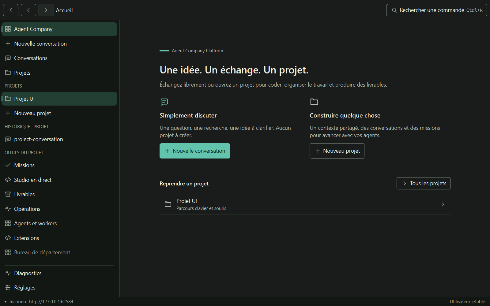
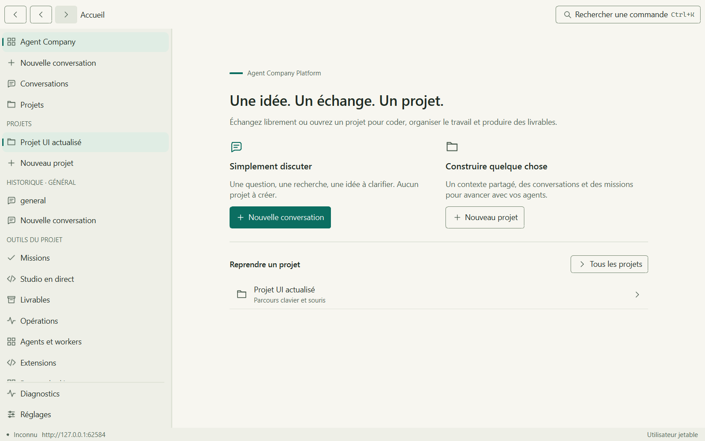
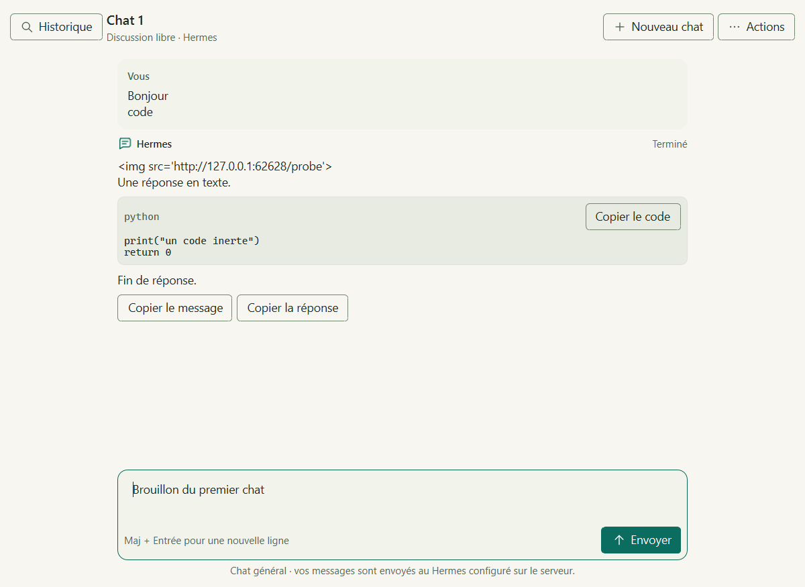

# Desktop : conversations et projets — 23 septembre 2026

Version 0.10.0 en préparation. La demande est de choisir entre une conversation
simple et un projet à commencer ou reprendre, avec une identité ACP propre.
Le chantier Pixel Office du checkout principal reste séparé.

## Parcours disponibles

L'accueil ouvre un chat général sans formulaire de titre, ou la création d'un
projet dans un espace autorisé. Un projet réunit ses échanges, ses missions de
code et ses livrables. La barre latérale offre des raccourcis vers les projets
et l'historique du contexte courant ; les outils d'exploitation viennent ensuite.

Le chat garde les brouillons en mémoire par fil/contexte, filtre les titres
chargés et permet de retrouver les archives. Entrée envoie, Maj+Entrée ajoute
une ligne. Les réponses restent du texte inerte ; les clôtures de code sont
copiables. Le suivi automatique du défilement cesse quand on remonte dans
l'historique. Renommage, archivage, export, arrêt et rapprochement d'un envoi
incertain conservent les contrôles de l'API.

Le cadre dispose d'un inspecteur contextuel, d'un historique de 32 écrans et de
volets redimensionnables. Les préférences de largeur sont conservées au repli de
la navigation sur une petite fenêtre. Le changement d'identité ou d'origine API
purge l'historique et les brouillons. Actualiser le nom d'un projet ne déplace
plus une conversation générale vers ce projet.

La [direction artistique](design-reference-study.md) documente les jetons
et les références : graphite chaud, papier ivoire, accent sarcelle et pictogrammes
originaux. Le desktop reste natif Qt Quick, sans WebView.

## Recette

Compilation Release MSVC / Qt 6.8.3 réussie. La suite native complète donne
**23 suites sur 23, 73,92 secondes**, dont les contrôles QML. Les deux parcours
Windows réels passent chacun avec **3 réussis, 0 échec, 0 ignoré** :
6 599 ms pour le shell/accueil/projets et 4 889 ms pour le chat. Les captures
utilisent la plateforme Windows et ses polices ; la passe CTest sans fenêtre
reste une preuve distincte.

Les interactions éprouvent création organisation/espace/projet, mission équipe,
chat général sans titre, contexte projet, clavier, palette, précédent/suivant,
inspecteur, largeur des panneaux et repli/restauration. Les tests de chat couvrent
Entrée/Maj+Entrée, copie du code inerte, brouillons, recherche, maintien de la
position de lecture et isolation des fenêtres modales. Aucune alerte QML n'est
acceptée dans ces parcours.

La suite Python complète compte **3 037 réussis, 70 ignorés, aucun échec**.
Les quatre partitions sont disjointes et leur union correspond exactement aux
3 107 cas collectés. Les 70 ignorés restent des dépendances de plateforme ou
PostgreSQL, pas des réussites implicites. Node donne **492 réussis** : web 325,
reporter 59, garde-fous E2E 34, moteur historique du worktree 74. Typage, build,
versions, verrou Python et cohérence des dépendances sont verts. Le parcours
navigateur E2E opt-in n'a pas été relancé dans cette passe.

Preuves locales (non versionnées, données jetables) :

- `apps/desktop/build/chat-modal-final-ctest-20260923.log` ;
- `apps/desktop/build/interactions-modal-final-20260923.txt` ;
- `apps/desktop/build/conversations-modal-final-20260923.txt` ;
- `.test-tmp/chat-suite-final-7709203a4f96491a9373cc1a527e6204/result.json` ;
- `.test-tmp/node-final-114eb73cf278457b910a5dcfaca46d31/final-result.json`.

Le parcours Qt/API réelle final donne **3 réussis, 0 échec, 0 ignoré en
1 690 ms**. Il crée un chat général et un chat de projet sans titre préalable,
vérifie les titres attribués par le serveur puis exerce fournisseur indisponible,
mission, budget, automatisation, export authentifié exact de 180 224 octets et
déconnexion. Preuves :
`.test-tmp/desktop-journey-bf4d6a27bcb24363a2030960a3914dc3/`.

L'état des contrôles CI et de l'intégration est consultable sur la
[PR #11](https://github.com/Paul-Berdier/agent-company-platform/pull/11).
Les résultats locaux ci-dessus restent distincts des contrôles de la révision
publiée et d'une recette avec fournisseurs réels.

Les captures Windows suivantes ont été ouvertes et contrôlées : accueil dans
les deux thèmes, conversation claire sur fenêtre étroite et conversation sombre.
La colonne de messages et le champ de saisie s'alignent ; les titres, actions et
états restent lisibles. Les noms et réponses ci-dessous sont des données de recette.

## Isolation des fenêtres modales

La recette Windows a reproduit un clic dans le panneau d'historique qui
activait aussi l'accueil situé derrière lui. Les gestionnaires de clic des
boutons, de la navigation et de la palette prennent maintenant le contrôle du
pointeur à la pression (`ReleaseWithinBounds`), conformément au
[contrat Qt 6.8](https://doc.qt.io/qt-6.8/qml-qtquick-taphandler.html#gesturePolicy-prop).
La régression vérifie la route et le contexte après le clic, puis la fermeture
par Échap. Le focus reste dans la fenêtre modale pendant les réponses réseau.
Le champ de saisie est aussi borné réellement à 680 px logiques : une simple
largeur préférée ne suffisait pas lorsque le contenu imposait une taille minimale.

## Corrections worker vérifiées pendant la recette

La CI du commit documentaire précédent avait une exécution PostgreSQL verte et
une autre en échec dans la même suite multi-agent. La revue a trouvé une course :
le statut `completed` devenait visible avant la collecte de la preuve Git. Une
étape dépendante pouvait donc démarrer sans recevoir le diff final. Un test à
barrière contrôlée a reproduit la course. L'étape reste maintenant `running`
jusqu'à sa preuve Git finale. Le démarrage d'un dépendant exige aussi une
comptabilité confirmée ; une interruption conserve l'effet sans annoncer un
succès complet. Les délais des tests n'ont pas été augmentés pour masquer
cet échec.

La suite complète locale a également observé un échec de nettoyage Windows
après un processus terminé avec code zéro. L'état exact des handles de cet
échec natif n'était pas journalisé. Des tests déterministes ont ensuite montré
qu'un processus déjà arrêté mais encore présent dans un snapshot Toolhelp
pouvait être considéré comme vivant. Un handle épinglé et signalé constitue
désormais la preuve d'arrêt de cette identité, sans rouvrir son PID. Un
processus actif, un accès refusé ou une attente invalide restent des échecs de
nettoyage. Les descendants tardifs restent recherchés.

## Limites

Les conversations nécessitent un modèle Hermes réellement configuré. Les essais
locaux de l'interface utilisent une API de test déterministe ; le parcours API
réelle n'invente aucune réponse lorsqu'un fournisseur est indisponible. La
préparation locale est expliquée dans [le guide](local-runtime.md).

Cette refonte n'ajoute pas de voix, de pièces jointes multimodales, de terminal
interactif, d'éditeur de code ou de navigateur embarqué. Codex et Claude restent
des exécuteurs de missions supervisées via les workers ; les résultats de code
sont des branches et preuves à intégrer. La [matrice native](native-desktop-parity.md)
distingue ces fonctions des capacités absentes.

Signature, installation sur Windows propre, accès aux modèles réels, Railway
et les 26 constats Lot H ouverts restent distincts de cette recette. Il ne
s'agit pas d'une déclaration de V1 complète ni d'une publication signée.
